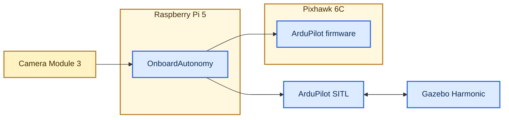

# OnboardAutonomy

[](https://github.com/matemink/OnboardAutonomy/actions/workflows/ci.yml)
[](https://isocpp.org/)
[](https://www.raspberrypi.com/)

OnboardAutonomy is a C++20 companion-computer runtime for ArduPilot UAVs.
It combines MAVLink telemetry and commands, camera ingestion, AprilTag
tracking, safety supervision, and vision-guided precision landing.

The same application runs with ArduCopter SITL in Gazebo or on a Raspberry
Pi 5 connected to a Pixhawk 6C. Flight behavior is verified in simulation;
the physical system is verified on a propeller-free hardware bench.

## Demo

- **Vision-guided autonomous landing** (`39 s`) - takeoff, target tracking,
  guidance, and precision landing.
  [](https://www.youtube.com/watch?v=rsuRYYDfZZI)
- **Hurricane-force wind stress test** (`36 s`) - the same autonomy flow under
  severe simulated gusts.
  [](https://www.youtube.com/watch?v=eqdRw3oofTI)

## System overview



ArduPilot owns stabilization and flight control. OnboardAutonomy owns
companion-computer concerns: perception, telemetry, startup orchestration,
landing guidance, safety supervision, diagnostics, and recovery.

## Highlights

- MAVLink 2 telemetry, command encoding, `COMMAND_ACK` handling, and stream
  configuration over SITL UDP or Linux USB/UART serial transport.
- Readiness-gated takeoff and AprilTag precision landing with stale-target,
  target-loss, and companion-link fallback behavior.
- Raspberry Pi Camera Module 3 and Gazebo RTP/H.264 input through the same
  YUV420 perception pipeline, with a read-only browser preview.
- Non-blocking serial and camera recovery after disconnects, process exits,
  or bounded frame stalls.
- Packaged non-root `systemd` service, bounded JSONL logs, and Raspberry Pi
  CPU, memory, temperature, and latency profiling.
- Native C++ tests, Python integration and fault-injection tests, and an ARM64
  cross-build quality gate in GitHub Actions.

## Verified hardware

| Environment | Verification |
| --- | --- |
| Gazebo Harmonic / ArduCopter SITL | Automated takeoff, target tracking, landing, wind stress, and link-loss behavior |
| Raspberry Pi 5 / Camera Module 3 Wide | ARM64 runtime, calibrated AprilTag pose, camera recovery, and concurrent runtime profiling |
| Pixhawk 6C | USB recovery, TELEM2/GPIO UART, live health and metadata, and acknowledged MAVLink requests |

The documented Raspberry Pi camera run sustained `30.013 FPS`, zero
processing drops, and approximately `10 ms` sensor-to-application latency.
Ten offset Gazebo flights completed automatic disarm with `0.000 m` worst
landing error at MAVLink telemetry resolution. Reproduction details and raw
limitations are linked below.

## Run locally

After completing the [Gazebo setup](docs/simulation.md), Windows users can
start the showcase, SITL, camera preview, and operator console with:

```text
StartOnboardAutonomyGazeboShowcase.cmd
```

The first run starts automatically. After disarm, press `S` to repeat or `Q`
to exit. For a native development build:

```bash
sudo bash scripts/bootstrap_ubuntu.sh
cmake -S . -B build -G Ninja -DCMAKE_BUILD_TYPE=Debug
cmake --build build --parallel
ctest --test-dir build --output-on-failure
python3 -m unittest discover -s python/tests -v
```

## Safety

Normal startup is observation-only. Motion requires an explicit `--sitl`
assertion; serial and unknown or real UDP endpoints remain observation-only.
Before autonomous startup, the runtime validates the configured ArduPilot
companion-heartbeat failsafe and never changes flight-controller parameters
automatically. Real bench work is performed without propellers.

## Documentation

- [Architecture](docs/architecture.md)
- [Development and SITL](docs/development.md)
- [Gazebo simulation](docs/simulation.md)
- [Raspberry Pi 5 and Pixhawk 6C bench](docs/raspberry-pi-5-bench.md)
- [Precision-landing evidence](docs/evidence/precision-landing-sitl.md)
- [Companion-link failsafe evidence](docs/evidence/companion-link-failsafe-sitl.md)
- [Raspberry Pi runtime profile](docs/evidence/raspberry-pi-runtime-profile.md)
- [Roadmap](docs/roadmap.md)
