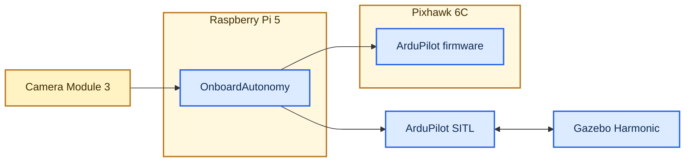

# OnboardAutonomy

OnboardAutonomy is a C++20 companion-computer runtime for ArduPilot UAVs. It
combines MAVLink, onboard vision, safety supervision, and precision landing.
The same application runs in Gazebo or on a Raspberry Pi 5 with a Pixhawk 6C.

## Demo

- **Vision-guided autonomous landing** (`39 s`) - takeoff, target tracking,
  guidance, and precision landing.
  
- **Hurricane-force wind stress test** (`36 s`) - the same autonomy flow under
  severe simulated gusts.
  

## System overview

ArduPilot owns stabilization and flight control. OnboardAutonomy turns camera
and telemetry data into supervised guidance for either SITL or a real Pixhawk.

## Highlights

- MAVLink 2 telemetry and acknowledged commands over SITL UDP or Linux
  USB/UART serial transport.
- Readiness-gated takeoff and AprilTag landing with target-loss and link-loss
  fallbacks.
- Dual-camera YUV420/OpenCV processing for AprilTag landing and forward ONNX
  aerial-object detection.
- SITL-only forward-object lock confirms spatial and temporal continuity,
  then applies bounded yaw centering while the vehicle remains in GUIDED hold.
- Automatic serial and camera recovery after disconnects or process stalls.
- Motion is SITL-gated; physical endpoints remain observation-only. CI covers
  C++ tests, Python integration and fault injection, plus a native ARM64 build.

## Built and tested with

- **Simulation:** ArduCopter SITL, Gazebo Harmonic, OpenCV, and GStreamer.
- **Hardware:** Raspberry Pi 5, Camera Module 3 Wide, and Pixhawk 6C over USB
  and TELEM2 UART.
- **Evidence:** repeatable precision-landing runs, companion-link failsafe
  injection, camera and serial recovery, and ARM runtime profiling.

## Explore

- [Architecture](docs/architecture.md)
- [Run the Gazebo demo](docs/simulation.md)
- [Hardware bench and evidence](docs/raspberry-pi-5-bench.md)
