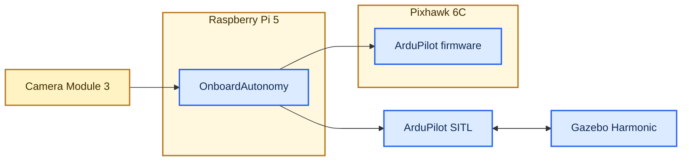

# OnboardAutonomy

[](https://github.com/matemink/OnboardAutonomy/actions/workflows/ci.yml)
[](https://isocpp.org/)
[](https://www.raspberrypi.com/)

OnboardAutonomy is a C++20 onboard autonomy runtime for ArduPilot-based
UAVs. It runs against ArduCopter SITL or a physical Pixhawk, handles
MAVLink command and telemetry flows, processes onboard camera frames,
and exposes vehicle state through an operator console and JSON snapshots.

The project implements vision-guided precision landing in ArduCopter SITL
and Gazebo and is progressing toward the same path on a Raspberry Pi 5 and
Pixhawk 6C. Development remains reproducible without real flight: motion is
verified in simulation, while hardware work is performed on a propeller-free
bench.

## System overview



Amber containers and nodes represent physical hardware; blue nodes
represent software.

ArduPilot remains responsible for stabilization and flight control.
OnboardAutonomy owns companion-computer concerns: telemetry, health,
flight startup, vision, landing guidance, safety supervision, and
diagnostics. The diagram shows the target deployment: camera frames enter
OnboardAutonomy on Raspberry Pi 5, which sends guidance through either
ArduPilot firmware on a physical Pixhawk or ArduPilot SITL. In simulation,
the same runtime can run on the Ubuntu/WSL development host instead of the
Pi.

## Capabilities

- MAVLink 2 decoding and encoding through pinned generated C headers.
- UDP transport for SITL and Linux serial transport for Pixhawk USB/UART.
- Freshness-aware GPS, battery, system-health, PreArm, and link state.
- Sequential telemetry-rate configuration with `COMMAND_ACK`, timeouts,
  and bounded retries.
- ArduPilot firmware and board metadata without model-name guessing.
- A production-shaped autonomy runtime with readiness-gated takeoff,
  fresh vision intent, independent safety supervision, and precision
  landing with a bounded target-loss fallback.
- Read-only validation of ArduPilot's companion-heartbeat failsafe before
  autonomous startup, with an independent link-cut SITL acceptance test.
- Raspberry Pi Camera Module 3 and Gazebo RTP/H.264 ingestion into the same
  YUV420 pipeline, with performance metrics, AprilTag detection, and a
  read-only browser preview. Both camera backends restart automatically after
  a process exit or bounded frame stall.
- Non-blocking Linux serial I/O that detects device hangup, reopens a stable
  device path, and restarts telemetry configuration after heartbeat recovery.
- A packaged non-root `systemd` service with automatic startup recovery and
  size/count-bounded streaming JSONL logs mirrored to `journald`.
- A bounded Raspberry Pi process-group profiler for CPU, RSS, temperature,
  throttling, and machine-readable baseline reports.
- Native Linux tests, Python integration tests, fault injection, and an
  ARM64 cross-build quality gate in GitHub Actions.

## Verified environments

| Environment | Evidence |
| --- | --- |
| Ubuntu 24.04 / WSL2 | Native C++ build, unit tests, ArduCopter SITL, and fault injection |
| Gazebo Harmonic | Automated takeoff, vision-guided landing, target-loss fallback, and H.264 camera stream |
| Raspberry Pi 5 | ARM64 runtime, Camera Module 3 Wide, and concurrent camera/MAVLink processing |
| Pixhawk 6C | Real USB MAVLink telemetry, health state, metadata, and acknowledged stream requests |

The measured Raspberry Pi camera path sustained `30.013 FPS` with zero
processing drops and approximately `10 ms` sensor-to-application latency
on the documented bench setup.

## Quick start

Ubuntu 24.04 or Raspberry Pi OS 64-bit is recommended.

After completing the Gazebo prerequisites in the
[simulation runbook](docs/simulation.md), Windows users can launch Gazebo,
ArduCopter SITL, the interactive OnboardAutonomy console, and the browser
camera preview with:

```text
StartOnboardAutonomyGazeboDemo.cmd
```

The first guarded precision-landing run starts automatically under a moderate
gusty-wind profile. After it finishes and the simulated vehicle disarms, press
`S` in the console to run the same scenario again or `Q` to exit
OnboardAutonomy. Automated acceptance uses the separate calm profile so
regression results remain repeatable. The Gazebo window shows the selected
wind profile in a compact wind-vane HUD instead of adding simulation detail
to the companion flight console. The HUD does not present the configured
profile as a physical wind measurement.

For a development build and fast generated-telemetry check:

```bash
sudo bash scripts/bootstrap_ubuntu.sh
cmake -S . -B build -G Ninja -DCMAKE_BUILD_TYPE=Debug
cmake --build build --parallel
ctest --test-dir build --output-on-failure
python3 -m unittest discover -s python/tests -v
```

Run the service with generated healthy MAVLink telemetry:

```bash
./build/onboard_autonomy --transport udp --udp-port 14550
```

In a second terminal:

```bash
python3 -m venv .venv
source .venv/bin/activate
python -m pip install -r python/requirements.txt
python python/scenario_runner.py --scenario healthy
```

Continue with the [development and SITL](docs/development.md),
[Gazebo simulation](docs/simulation.md), or
[Raspberry Pi/Pixhawk bench](docs/raspberry-pi-5-bench.md) runbook.

## Architecture

The code follows dependency inversion without introducing a framework:

```text
domain <- application <- adapters / presentation
```

Application-owned ports isolate MAVLink transport, camera capture,
target detection, and camera preview. CMake targets enforce the main
build-time boundaries, while test fakes exercise application behavior
without SITL, camera hardware, or a serial device.

| Path | Responsibility |
| --- | --- |
| `include/onboard_autonomy/domain/` | Vehicle concepts and readiness rules |
| `include/onboard_autonomy/application/` | Use cases and I/O ports |
| `src/adapters/` | MAVLink, transport, camera, preview, and AprilTag adapters |
| `src/presentation/` | Operator console |
| `tests/` | Dependency-light C++ tests |
| `python/` | Integration harnesses, fault injection, and camera tooling |
| `scripts/` | Reproducible development, simulation, and deployment commands |
| `docs/` | Architecture, runbooks, roadmap, and learning notes |

See [docs/architecture.md](docs/architecture.md) for the complete runtime
and build-time dependency diagrams.

## Project status

The telemetry, command, simulation, ARM deployment, camera ingestion,
calibrated AprilTag pose, and target-tracking stages are implemented. The
project-owned Gazebo world streams a downward camera over RTP/H.264 through
the same application camera port used by the rest of the vision pipeline.

The production autonomy path separates startup from continuous operation.
It verifies readiness, GUIDED mode, arming, and takeoff before consuming a
fresh AprilTag track through `WorldState`, `DecisionEngine`, and
`SafetySupervisor`. Approved body-FRD targets are streamed as MAVLink
`LANDING_TARGET` at 10 Hz; stale targets stop guidance immediately and a
bounded loss triggers an ordinary LAND. After stable alignment below 1.5 m,
close-range target loss latches vision guidance off for terminal descent.
Physical printed-target scale validation remains required before enabling
this path on a real aircraft. Ten consecutive offset Gazebo flights reached
8.04 m, completed automatic disarm, and recorded 0.000 m median, worst, and
population-standard-deviation landing error at MAVLink telemetry resolution.
A separate controlled link-cut run proved that
ArduPilot entered LAND 3.237 seconds after the final companion heartbeat,
without a companion LAND command. See [docs/roadmap.md](docs/roadmap.md).

## Safety

Normal startup is observation-only. Automated motion requires an
explicit `--sitl` assertion; neither UDP nor an interactive terminal is
treated as proof of simulation. Serial and unknown or real UDP endpoints
remain observation-only. Physical bench work is performed with propellers
removed, and autonomous behavior is validated in simulation before
hardware-in-the-loop testing.

Before any autonomous startup, the runtime reads `FS_GCS_ENABLE`,
`FS_GCS_TIMEOUT`, `FS_OPTIONS`, and `SYSID_MYGCS`. It accepts only the
documented Always LAND policy and never changes flight-controller parameters
automatically. See the
[companion-link failsafe evidence](docs/evidence/companion-link-failsafe-sitl.md).

## Documentation

- [Architecture](docs/architecture.md)
- [Development and SITL runbook](docs/development.md)
- [Gazebo simulation runbook](docs/simulation.md)
- [Raspberry Pi 5 and Pixhawk 6C bench](docs/raspberry-pi-5-bench.md)
- [Camera calibration workflow (Ukrainian)](docs/learning/29-camera-calibration.uk.md)
- [AprilTag target tracking (Ukrainian)](docs/learning/30-apriltag-target-tracking.uk.md)
- [Roadmap](docs/roadmap.md)
