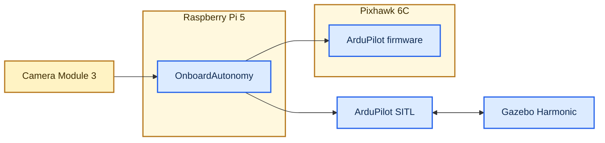

# OnboardAutonomy

OnboardAutonomy is a C++20 companion-computer runtime for ArduPilot UAVs. Its
primary simulation scenario uses a forward camera to detect and visually track
an airborne object, keep it near the center of the frame, and send supervised
guidance over MAVLink. The same runtime also runs observation-only on a
Raspberry Pi 5 with a Pixhawk 6C.

## Demo

- **Fiducial landing validation** (`39 s`) - a deterministic end-to-end test of
  takeoff, visual guidance, and landing.
  
- **Wind-disturbance validation** (`36 s`) - the fiducial scenario under severe
  simulated gusts.
  

## Current pursuit lab

One Gazebo scene contains a Holybro S500 multicopter, a Skywalker X8
fixed-wing pursuer, and a physics-backed Shahed-136 visual target. The scene
starts first; the operator then selects the pursuer in the console with the
arrow keys and Enter. Only the selected vehicle receives mission commands.

The S500 path supports takeoff and camera-based yaw tracking. Skywalker
selection, telemetry, camera routing, and ArduPlane guidance are integrated,
while its reliable simulated launch and sustained pursuit remain in progress.
The Shahed model follows a controlled ArduPlane flight path, responds to wind,
and loses propulsion after contact instead of moving on a scripted rail.

## System overview

```mermaid
flowchart LR
    Camera["Camera Module 3"]

    subgraph Pi["Raspberry Pi 5"]
        Runtime["OnboardAutonomy"]
    end

    subgraph FC["Pixhawk 6C"]
        Firmware["ArduPilot firmware"]
    end

    Camera --> Runtime
    Runtime --> Firmware
    Runtime --> SITL["ArduPilot SITL"]
    SITL <--> Gazebo["Gazebo Harmonic"]

    classDef hardware fill:#FFF3C4,stroke:#B7791F,color:#3D2C00,stroke-width:2px
    classDef software fill:#DCEBFF,stroke:#2563EB,color:#0F2A52,stroke-width:2px
    class Camera hardware
    class Runtime,Firmware,SITL,Gazebo software
    style Pi fill:#FFF8DE,stroke:#B7791F,stroke-width:2px,color:#3D2C00
    style FC fill:#FFF8DE,stroke:#B7791F,stroke-width:2px,color:#3D2C00
```

ArduPilot owns stabilization and flight control. OnboardAutonomy turns camera
and telemetry data into supervised guidance for either SITL or a real Pixhawk.

## Highlights

- MAVLink 2 telemetry and acknowledged commands over SITL UDP or Linux
  USB/UART serial transport.
- Forward-object lock confirms spatial and temporal continuity, then applies
  bounded yaw guidance to keep the tracked object near the image center.
- Transient controller-link recovery pauses stale yaw guidance, revalidates the
  failsafe, and resumes tracking without restarting the mission.
- Dual-camera YUV420/OpenCV processing with COCO airplane detection through a
  YOLOX ONNX model.
- Optional AprilTag-based precision landing remains as a deterministic
  validation scenario with target-loss and link-loss fallbacks.
- Automatic serial and camera recovery after disconnects or process stalls.
- Motion is SITL-gated; physical endpoints remain observation-only. CI covers
  C++ tests, Python integration and fault injection, plus a native ARM64 build.

## Built and tested with

- **Simulation:** ArduCopter SITL, Gazebo Harmonic, OpenCV, and GStreamer.
- **Hardware:** Raspberry Pi 5, Camera Module 3 Wide, and Pixhawk 6C over USB
  and TELEM2 UART.
- **Evidence:** repeatable precision-landing runs, companion-link failsafe
  injection, camera and serial recovery, and ARM runtime profiling.

## Explore

- [Architecture](docs/architecture.md)
- [Run the Gazebo demo](docs/simulation.md)
- [Hardware bench and evidence](docs/raspberry-pi-5-bench.md)
- [Release status and verified scope](docs/release-status.md)
