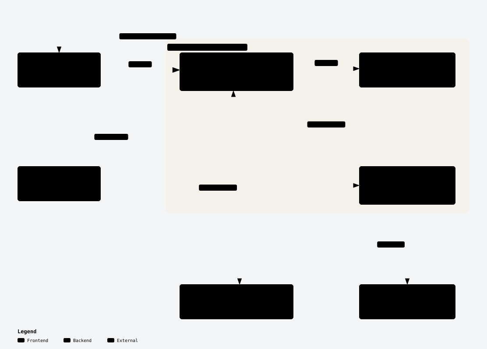

# OnboardAutonomy

[](https://github.com/matemink/OnboardAutonomy/actions/workflows/ci.yml)
[](https://isocpp.org/)
[](https://www.raspberrypi.com/)

OnboardAutonomy is a C++20 telemetry and camera observation prototype for
ArduPilot, with a Raspberry Pi 5 / Pixhawk 6C hardware bench and Gazebo + SITL
simulation. It provides console status, browser camera preview, JSONL diagnostics,
and connection/camera recovery. ArduPilot owns flight control.

## Current prototype structure

<a href="https://matemink.github.io/OnboardAutonomy/">
  <picture>
    <source media="(prefers-color-scheme: dark)" srcset="docs/diagrams/overview-dark.svg">
    
  </picture>
</a>

[Explore the interactive map](https://matemink.github.io/OnboardAutonomy/) ·
[Package responsibilities](docs/architecture.md) ·
[Diagram source and refresh guide](docs/diagrams/README.md)

The map follows the current observation runtime; source links identify the
inspected revision. Optional outputs are labeled with their enabling flags.

## Runtime

- MAVLink 2 over UDP or Linux USB/UART, with controller identity filtering,
  telemetry freshness, command acknowledgements, and bounded retries.
- Forward-only Gazebo preview by default, with an optional downward feed.
- Independent camera streams through GStreamer or `rpicam-vid`, with automatic
  recovery after producer failure or stalled frames.
- A compact console with telemetry, health warnings, optional camera diagnostics,
  and the last MAVLink frames with their age; JSONL and a browser camera preview.
- ArduPilot-owned companion-link failsafe validation and explicit separation
  between simulation and physical endpoints.

The companion sends heartbeat, telemetry setup, and read-only information
requests. The demo observes the vehicle and camera frames; it does not start a
flight or run a pursuit/landing controller. Interactive input provides `Q` to quit.

## Run on Windows

After installing the simulator and building the runtime as described in the
[development](docs/development.md) and [simulation](docs/simulation.md) guides:

```bat
run.cmd gazebo
```

This opens Gazebo, ArduPilot SITL, the telemetry console and the browser preview
at `http://localhost:8080/`. Expect one forward camera panel by default. Set
`ONBOARD_AUTONOMY_DOWNWARD_CAMERA=1` to also enable the downward observation feed.

| Command | Purpose |
| --- | --- |
| `run.cmd gazebo` | Camera simulation, telemetry console and browser preview |
| `run.cmd gazebo showcase` | The same demo with the optional showcase scene |
| `run.cmd sitl` | SITL telemetry without Gazebo |
| `run.cmd pi` | Connect to the Raspberry Pi bench over SSH |
| `run.cmd stop` | Stop this checkout's tagged Gazebo demo processes |

Machine settings belong in ignored `.local/windows/gazebo.cmd` or `pi.cmd`;
see the respective simulation and hardware guides. Linux uses the Bash launchers
in `scripts/` directly. Windows implementations live in `scripts/windows/`.

## Build and check

The verified development environment is Ubuntu 24.04 / WSL2; CI also builds
natively on ARM64. Follow the [development runbook](docs/development.md) for
system dependencies, then:

```bash
cmake -S . -B build -G Ninja -DCMAKE_BUILD_TYPE=Debug
cmake --build build --parallel
ctest --test-dir build --output-on-failure
PYTHONPATH=python python3 -m unittest discover -s python/tests -v
ruff check python scripts
```

CMake fetches pinned dependencies. Generic OpenCV DNN / YOLOX utilities and
calibration tools remain available for independent image experiments; they
are not connected to flight control or enabled by the camera demo. OpenCV DNN
is opt-in with `-DONBOARD_AUTONOMY_ENABLE_OPENCV_DNN=ON`; it builds a standalone
library and is never linked into the companion executable.

## Explore

- [Architecture and package responsibilities](docs/architecture.md)
- [Gazebo camera simulation](docs/simulation.md)
- [Raspberry Pi 5 hardware bench](docs/raspberry-pi-5-bench.md)

## Status and evidence

CI covers C++ tests, Python integration/fault injection, Windows command dispatch,
static analysis and native ARM64 builds. Generated UDP telemetry and synthetic video check the
runtime independently of a complete Gazebo session. A passing build or unit suite
alone does not prove the full simulator or physical bench scenario.

Hardware evidence identifies the binary and workload actually measured:

- [Serial recovery](docs/evidence/serial-recovery.md)
- [Pixhawk TELEM2 UART](docs/evidence/uart-hardware.md)
- [Camera recovery](docs/evidence/camera-recovery.md)
- [Historical Raspberry Pi runtime profile](docs/evidence/raspberry-pi-runtime-profile.md)

Historical logs may refer to features removed from the current prototype;
they are not current performance claims. The build version is recorded in
`CMakeLists.txt`.
