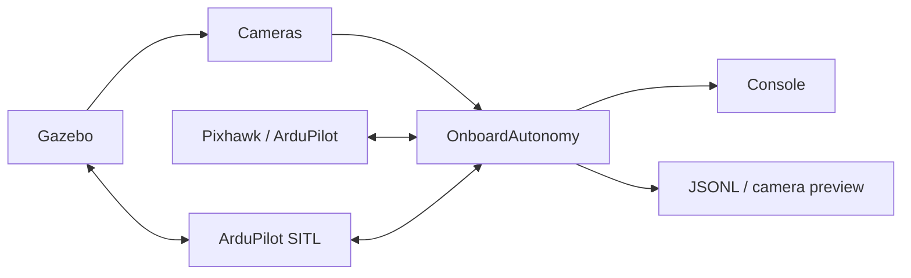

# OnboardAutonomy

[](https://github.com/matemink/OnboardAutonomy/actions/workflows/ci.yml)
[](https://isocpp.org/)
[](https://www.raspberrypi.com/)

OnboardAutonomy is a C++20 companion-computer runtime for ArduPilot UAVs.
It brings together MAVLink telemetry, camera capture, operator diagnostics,
and fault recovery. Both the physical Raspberry Pi 5 / Pixhawk 6C bench and SITL run in
observation mode. The runtime has no flight-command or pursuit controller.

## Runtime

- MAVLink 2 over UDP or Linux USB/UART, with controller identity filtering,
  telemetry freshness, command acknowledgements, and bounded retries.
- Forward-only Gazebo preview by default, with an optional downward feed.
- Independent camera streams through GStreamer or `rpicam-vid`, with automatic
  recovery after producer failure or stalled frames.
- A compact console with telemetry, health warnings, optional camera diagnostics,
  and the last MAVLink frames with their age; JSONL and a browser camera preview.
- ArduPilot-owned companion-link failsafe validation and explicit separation
  between simulation and physical endpoints.

ArduPilot owns stabilization, navigation, and flight control. The companion
runtime observes its telemetry and camera frames. Its outbound protocol is
limited to companion heartbeat, telemetry setup, and read-only information
requests. Interactive input provides `Q` to quit.


```mermaid
flowchart LR
    Cameras --> Runtime[OnboardAutonomy]
    Pixhawk[Pixhawk / ArduPilot] <--> Runtime
    SITL[ArduPilot SITL] <--> Runtime
    Gazebo --> Cameras
    Gazebo <--> SITL
    Runtime --> Console
    Runtime --> Diagnostics[JSONL / camera preview]
```

## Build and check

The verified development environment is Ubuntu 24.04 / WSL2; CI also builds
natively on ARM64. Follow the [development runbook](docs/development.md) for
system dependencies, then:

```bash
cmake -S . -B build -G Ninja -DCMAKE_BUILD_TYPE=Debug
cmake --build build --parallel
ctest --test-dir build --output-on-failure
PYTHONPATH=python python3 -m unittest discover -s python/tests -v
ruff check python scripts
```

CMake fetches pinned dependencies. Generic OpenCV DNN / YOLOX utilities and
calibration tools remain available for independent image experiments; they
are not connected to flight control or enabled by the camera demo. OpenCV DNN
is opt-in with `-DONBOARD_AUTONOMY_ENABLE_OPENCV_DNN=ON`; it builds a standalone
library and is never linked into the companion executable.

## Explore

- [Architecture and package responsibilities](docs/architecture.md)
- [Gazebo camera simulation](docs/simulation.md)
- [Raspberry Pi 5 hardware bench](docs/raspberry-pi-5-bench.md)
- [Release status and evidence boundaries](docs/release-status.md)

Historical hardware measurements identify their tested binary and workload;
they do not automatically describe the current revision. CI covers C++ tests,
Python integration and fault injection, static analysis, and native ARM64 builds.
