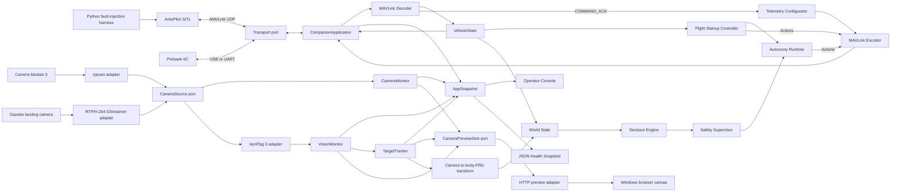
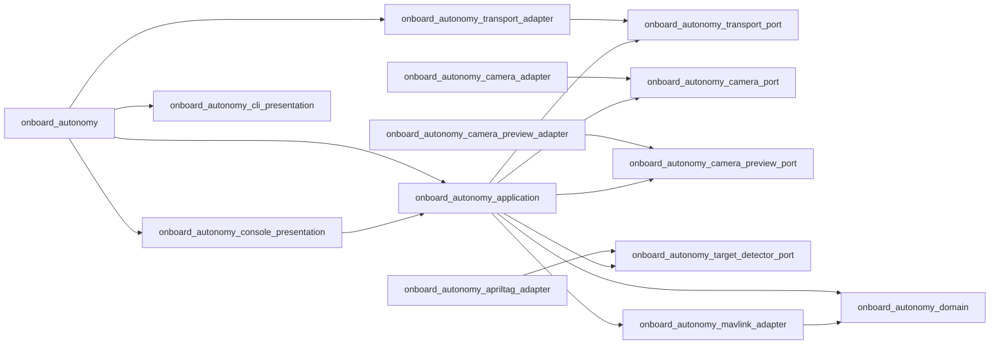

# Architecture

OnboardAutonomy keeps flight-controller I/O, protocol decoding, state,
autonomy decisions, safety supervision, vision, and test orchestration
separate.

## Build-time boundaries

## Design boundaries

### Transport

The application-owned `Transport` port moves bytes only. UDP and Linux
serial adapters implement that contract without understanding MAVLink
or vehicle readiness. UDP can represent SITL or a real network bridge;
Linux serial is used for the Pixhawk bench connection. Transport type is
therefore never evidence that motion is safe. Every `Transport::read()` is non-blocking:
it returns the bytes already available or `0` immediately. UDP uses a
non-blocking socket, while serial uses `VMIN=0` and `VTIME=0`. MAVLink
frames remain independent of read boundaries, and the five-millisecond
main-loop sleep prevents busy spinning when all inputs are quiet.

The CLI represents transport as a typed `udp|serial` choice and validates
backend-specific options before constructing an adapter. UDP remains the
documented default for observation-only startup; selecting serial requires an
explicit device path.

### Camera source and monitor

The application-owned `CameraSource` port returns typed YUV420 frames
without exposing Linux processes or `rpicam` arguments. The Linux
`RpicamCameraSource` adapter starts `rpicam-vid` with a fixed manual
hyperfocal lens position, receives fixed-size raw
frames through one pipe, and receives per-frame metadata through another.
The `GStreamerCameraSource` adapter starts an explicit `gst-launch-1.0`
pipeline, receives Gazebo RTP/H.264 over UDP, decodes it, and publishes the
same fixed-size I420 frame type through the same port. The application layer
therefore does not branch between physical and simulated cameras.

Both adapters treat a process exit, pipe failure, missing metadata, or two
seconds without frame progress as a recoverable source failure. They stop the
child process, wait for a bounded retry delay, and start it again until the
owner requests shutdown. `CameraSourcePhase::reconnecting`, the last error,
and a monotonic restart counter cross the port; the first complete frame moves
the source back to `streaming`. Only complete frames receive sequence numbers,
so retry attempts do not masquerade as dropped camera frames.

`FrameWallClock` is paired with each completed frame. `CameraMonitor`
calculates consumed FPS, sequence gaps, latest/average/maximum
sensor-to-application latency, and frame age. It does not know whether
the source is `rpicam`, GStreamer, or a test fake. Gazebo frames do not carry
the Raspberry Pi `FrameWallClock`, so their capture latency remains unknown
rather than being reported as a fabricated zero.

### Vision and camera preview

The application-owned `TargetDetector` port maps a `CameraFrame` into
typed `TargetObservation` values. The current adapter uses the official
AprilTag 3 implementation with the `tagStandard41h12` family and reads
the Y plane directly, without OpenCV or a color conversion. With a
quality-gated camera calibration and measured tag span, it undistorts
the corners and estimates metric camera-optical pose.

The application-owned `TargetTracker` accepts only finite, forward-facing,
uncorrected poses above the decision-margin threshold. It requires three
consecutive observations before declaring a lock, supports optional EMA
translation smoothing, exposes observation age, and expires the track after
500 ms. Production guidance uses the current translation without EMA because
the measurement is relative to a moving body frame. A confirmed track keeps
one tag identity until expiry
instead of jumping between visible markers. Rotation remains raw because
averaging rotation matrices component by component would be mathematically
invalid.

The separate application-owned `CameraPreviewSink` receives the same
frame plus its current detections and track snapshot. Its HTTP adapter
rate-limits copies to 10 FPS and serves raw luminance bytes to a browser
canvas. The browser draws target corners and shows acquisition, lock,
filtered position, and freshness. Neither the application nor the camera
adapter depends on HTTP or HTML.

### MAVLink decoder

The decoder owns parser state so fragmented messages can span multiple
reads. It uses generated `c_library_v2` headers and maps only supported
messages into domain observations. Heartbeats from non-autopilot
components are ignored when selecting the vehicle identity.

### MAVLink encoder

The encoder uses the same generated MAVLink headers to create outbound
frames. OnboardAutonomy discovers the autopilot system ID, uses component ID
`191`, and broadcasts an onboard-controller heartbeat at 1 Hz.

### Companion-link failsafe policy

The MAVLink adapter forwards generic `PARAM_VALUE` records without embedding
safety policy. `CompanionLinkFailsafe` in the application layer gives the four
required ArduPilot values typed meaning: action, timeout, options bitmask, and
watched heartbeat system id.

Autonomous startup requires `FS_GCS_ENABLE=5` (Always LAND), a timeout from 2
to 10 seconds, no GCS continuation override in `FS_OPTIONS`, and
`SYSID_MYGCS` equal to the onboard-controller heartbeat system id. Values are
requested repeatedly after connection and reset when the flight-controller
heartbeat becomes stale. They are never written automatically.

This creates two independent layers. OnboardAutonomy stops new actions when
its input becomes stale. ArduPilot monitors the 1 Hz companion heartbeat and
performs LAND if the Raspberry Pi, process, cable, or MAVLink route disappears.
The UDP link-cut acceptance keeps ArduPilot alive while isolating the companion
and verifies both sides from JSON and tlog evidence.

### Vehicle state

The state model owns freshness windows and readiness rules. Missing data
is unknown rather than healthy. A heartbeat older than three seconds
invalidates the entire connected snapshot.

### Application

`CompanionApplication` owns the long-running use-case orchestration:
reading transport bytes, feeding the decoder, scheduling the companion
heartbeat, advancing telemetry setup and flight startup, constructing
fresh world state, running autonomy and safety decisions, and writing
outbound frames. Its public header uses Pimpl so MAVLink implementation
types do not leak into callers.

`AppSnapshot` combines domain state with application-level heartbeat,
telemetry-setup, and companion-link failsafe status. Presentation depends on
this neutral model,
not on `MavlinkDecoder` or `TelemetryStreamConfigurator`.

### Telemetry configurator

After discovering the vehicle system ID, the configurator requests
health, GPS, battery, global position, local NED position, and attitude
streams. Requests are sent sequentially because `COMMAND_ACK` identifies
the command but does not echo the requested message ID. Each request has
a two-second timeout and at most three attempts. Disconnecting resets the
state machine.

### Production autonomy runtime

`FlightStartupController` owns the finite startup sequence: verify an
ArduPilot multicopter, complete telemetry, validate the ArduPilot-owned
link-loss LAND policy, wait for pre-arm readiness,
enter GUIDED, arm, take off, and confirm each transition from both
`COMMAND_ACK` and vehicle telemetry. Commands use bounded retries and phase
deadlines. The controller does not own landing guidance.

After startup, `WorldState` is the immutable input for one decision cycle.
`DecisionEngine` may create a short-lived `DesiredMotion`, but it never sends
MAVLink. `SafetySupervisor` independently rejects disconnected, disarmed,
expired, or invalid motion. `AutonomyRuntime` converts only an approved
intent into `LANDING_TARGET` output at 10 Hz and requests LAND after one
second of continuously valid target data.

A missing or stale target stops vision setpoints immediately and resets the
warmup. If no target is available for five seconds before LAND, the runtime
requests an ordinary ArduPilot LAND instead of hovering indefinitely. After
LAND is accepted, completion still requires telemetry-confirmed DISARMED.

Python remains test orchestration: it starts SITL, injects failures, and
asserts behavior from JSON output.

### Guidance

Vision produces a confirmed, freshness-aware metric track in the
camera-optical frame. `CompanionApplication` applies the configured rigid
camera-to-body transform. `DecisionEngine`, `SafetySupervisor`, and
`AutonomyRuntime` own intent lifetime, target warmup, stream cadence, and
target-loss behavior; the MAVLink adapter only encodes the resulting
`LANDING_TARGET`. ArduPilot remains responsible for the flight-control loop.
Physical scale and mounting measurements are still a required safety gate
before enabling this path on real hardware.
