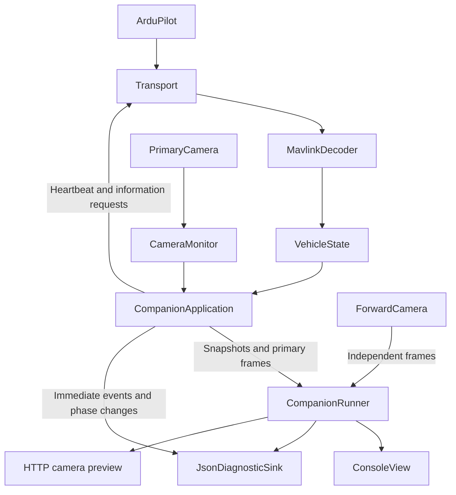

# Architecture

The C++ runtime observes MAVLink telemetry and camera frames. Bootstrap owns
adapters and their lifetimes; the application maintains state; presentation
consumes value snapshots and observation events.

## Packages

| Package | Responsibility |
| --- | --- |
| `bootstrap` | Configuration, adapter ownership, polling and publication |
| `hardware/transport` | UDP, serial and reconnect |
| `hardware/mavlink` | MAVLink decoding, heartbeat and information requests |
| `hardware/camera` | Capture, child-process recovery and frame delivery |
| `mission/flight` | Vehicle telemetry, freshness and readiness |
| `mission/safety` | Read-only companion-link failsafe validation |
| `mission/cv` | Camera monitoring and independent image-processing utilities |
| `operator/cli` | Argument parsing and validation |
| `operator/ui` | Console rendering and quit input |
| `diagnostics` | JSONL records and HTTP camera preview |

## Runtime data flow

```mermaid
flowchart TD
    ArduPilot --> Transport --> Decoder[MavlinkDecoder]
    Decoder --> Vehicle[VehicleState] --> Application[CompanionApplication]
    Application -->|Heartbeat and information requests| Transport
    PrimaryCamera --> Monitor[CameraMonitor] --> Application
    Application -->|Snapshots and primary frames| Runner[CompanionRunner]
    ForwardCamera -->|Independent frames| Runner
    Runner --> Console[ConsoleView]
    Runner --> JSON[JsonDiagnosticSink]
    Runner --> Preview[HTTP camera preview]
    Application -->|Immediate events and phase changes| JSON
```

`MissionRuntime` owns the transport, primary camera and application. The
application holds non-owning adapter references and is destroyed first.
`Program` owns the forward-camera monitor, preview server and output sinks.
The runner polls the application and publishes snapshots and camera frames.

## Dependency and lifecycle rules

- Mission headers depend on models and ports, not concrete hardware adapters.
  MAVLink routing in `CompanionApplication.cpp` is the existing explicit exception.
- Console and JSON presentation depend on value models and ports, not execution
  libraries. `AppSnapshot` contains values rather than controller headers.
- Protocol events and failsafe phase changes reach attached sinks immediately;
  periodic snapshots and the bounded console history do not control event delivery.
- Camera adapters own, stop and reap their producer processes. The optional
  forward camera is capture-only; the executable does not load a detector.
- ArduPilot owns flight control. Outbound companion messages provide heartbeat,
  telemetry setup and read-only information requests.

`python/tests/test_architecture_boundaries.py` checks include boundaries and
public-header cycles. `cmake/Architecture.cmake` checks direct and transitive
presentation link dependencies. These enforce structure; integration and hardware
checks establish runtime behavior.

For build commands see [development](development.md); for launch behavior see
[simulation](simulation.md) and the [hardware bench](raspberry-pi-5-bench.md).
