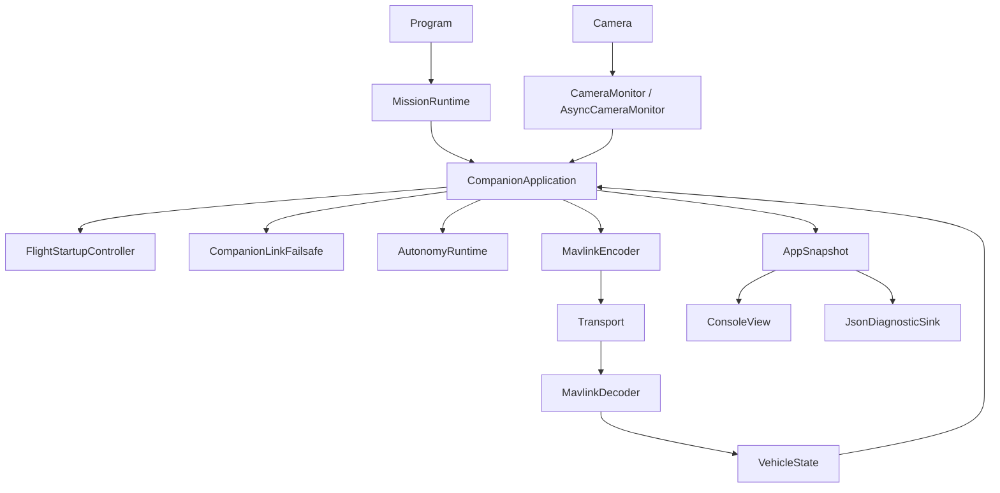

# Architecture

The executable assembles adapters, advances the application, and publishes
snapshots. Mission state is separate from console rendering and diagnostic
serialization. Source and public headers share the same package paths.

## Packages

| Package | Responsibility |
| --- | --- |
| `bootstrap` | Parse launch configuration, own adapters, run the application loop |
| `hardware/transport` | UDP and POSIX serial byte transport and reconnect |
| `hardware/mavlink` | Generated-protocol decoding, encoding, telemetry-rate setup |
| `hardware/camera` | GStreamer and rpicam child-process lifecycle and frame capture |
| `mission/flight` | Vehicle freshness/readiness, acknowledged startup operations |
| `mission/safety` | Endpoint motion policy and companion-link failsafe validation |
| `mission/cv` | Camera monitoring, detector ports, image preprocessing and tracking |
| `mission/autonomy` | Existing SITL runtime state and command scheduling |
| `operator/cli` | CLI parsing and configuration validation |
| `operator/ui` | Keyboard input and console snapshot rendering |
| `diagnostics` | HTTP camera preview and structured JSONL records |

`CMakeLists.txt` defines the compiled libraries and their dependencies. Interface
libraries expose transport, camera, detector, and preview contracts. Public
headers share one include root. Python architecture checks enforce package
include rules, reject cycles, and verify that the presentation model cannot
transitively import controllers. CMake configuration rejects direct or transitive
execution-library dependencies from console and logging targets.

## Data flow

```mermaid
flowchart TD
    Program --> MissionRuntime
    MissionRuntime --> Application[CompanionApplication]
    Transport --> Decoder[MavlinkDecoder]
    Decoder --> Vehicle[VehicleState]
    Camera --> Monitor[CameraMonitor / AsyncCameraMonitor]
    Monitor --> Application
    Vehicle --> Application
    Application --> Startup[FlightStartupController]
    Application --> Failsafe[CompanionLinkFailsafe]
    Application --> Runtime[AutonomyRuntime]
    Application --> Encoder[MavlinkEncoder]
    Encoder --> Transport
    Application --> Snapshot[AppSnapshot]
    Snapshot --> Console[ConsoleView]
    Snapshot --> JSON[JsonDiagnosticSink]
```

`MissionRuntime` owns its transport, primary camera, and application. The
application stores non-owning adapter references and is destroyed first.
`Program` assembles the optional forward camera, detector, preview server, and
snapshot sinks. Ports support in-memory fixtures without starting hardware.

## Telemetry and commands

`MavlinkDecoder` turns protocol frames into typed updates. `VehicleState` owns
freshness and readiness; missing values remain unknown. Only the selected
flight-controller identity may update live telemetry or acknowledge commands.
Reconnect clears stale controller data and restarts telemetry configuration.

`TelemetryStreamConfigurator` requests streams sequentially because
`COMMAND_ACK` does not echo the requested message ID. Startup and failsafe
validation have bounded attempts and deadlines. `CompanionApplication` routes
replies to these state machines and writes encoded requests.

Motion requires an explicit simulation assertion over UDP. Serial and unknown
endpoints remain observation-only. Ordinary LAND and RTL are encoded as
ArduPilot commands; there is no marker-guided landing path.

## Camera and diagnostics

The camera worker owns its child process through shutdown and reaping. Capture
and processing are decoupled so delayed consumers can drop old frames without
blocking MAVLink polling. The HTTP preview starts only after its listener is
ready and releases its worker after a startup failure.

The primary camera supplies observation frames. The optional forward detector
uses OpenCV DNN with YOLOX preprocessing and output decoding. Calibration
utilities remain available independently of flight behavior. Detection results
contain image coordinates and confidence. Marker pose, metric marker tracking,
and camera-to-body landing transforms have been removed.

`AppSnapshot` includes value snapshots, not controller headers. Each owning
package keeps its snapshot next to the controller or monitor that produces it.
`mission/Clock.hpp` supplies scheduling time without a dependency on vehicle
state. `mission/SnapshotSink.hpp` is the output port used by bootstrap and
implemented by console and JSON consumers.

Console and logging targets link the model library rather than the mission
runtime. JSON mapping lives in the private `SnapshotJson` implementation;
`JsonDiagnosticSink` owns record writing and sampled transition detection.
Python owns process orchestration, failure injection,
and independent protocol evidence; production runtime state remains in C++.

## Maintenance boundaries

Changes to protocol handling belong in the MAVLink adapter and vehicle model;
formatting belongs in the snapshot consumers. Keep orchestration focused on
routing and lifecycle rather than adding detector, UI, or transport details to
`CompanionApplication`.

The application currently routes MAVLink protocol records itself. The include
policy permits that dependency only in `src/mission/CompanionApplication.cpp`;
mission headers and controllers cannot include hardware adapters. This is an
explicit existing coupling, not a permission for the whole mission package.

`python/tests/test_architecture_boundaries.py` checks source/public-header
package dependencies, an explicit model/port allowlist for presentation, and
public-header cycles, accepting both quoted and angle-bracket project includes.
`cmake/Architecture.cmake` checks presentation link dependencies,
including generator expressions. These checks do not establish correctness of
flight behavior, event delivery, or hardware recovery.
